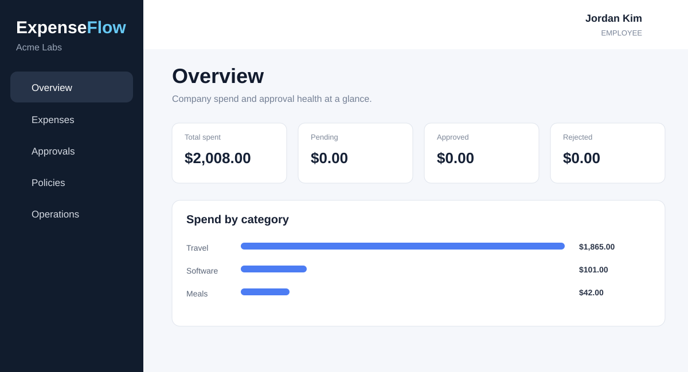
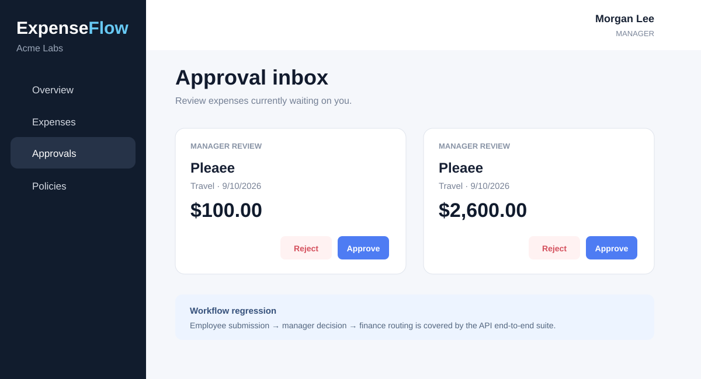
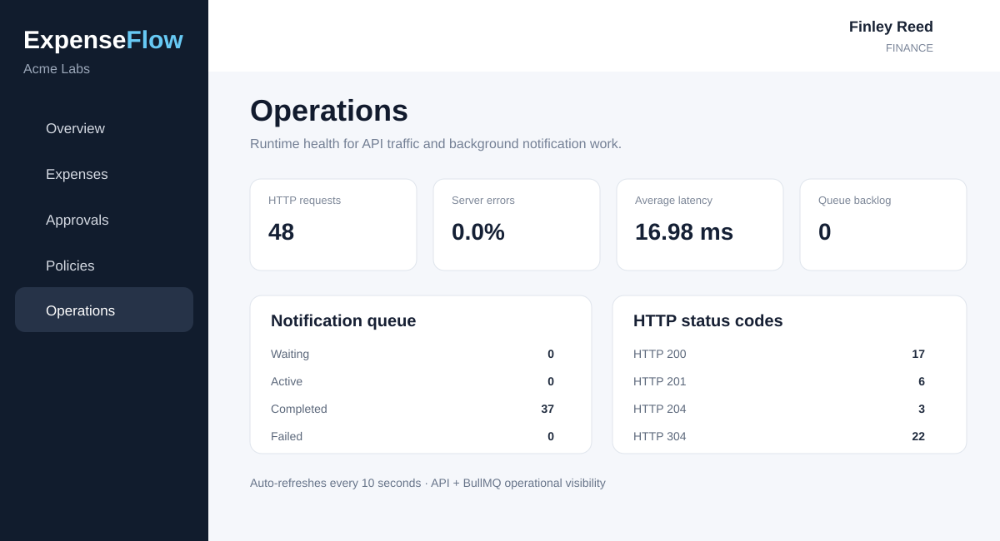
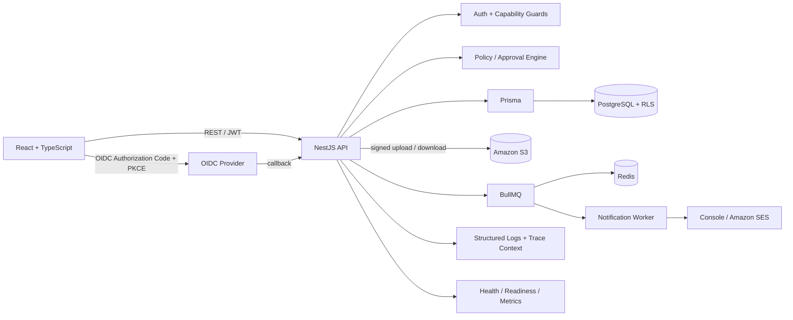
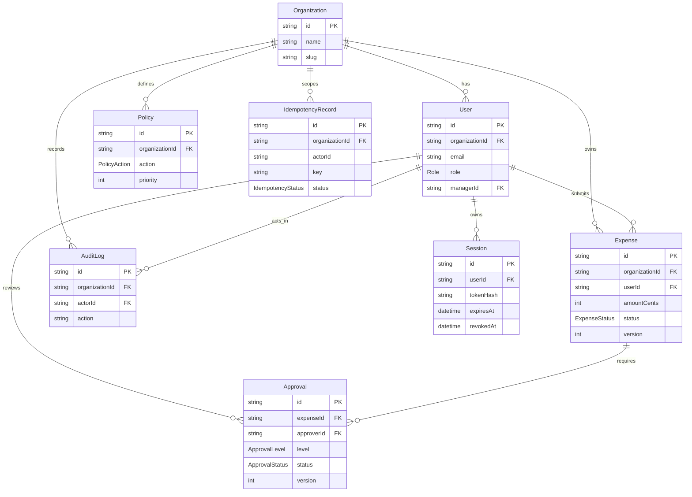

# ExpenseFlow

[](https://github.com/AdemolaAdedoyin/expenseflow/actions/workflows/ci.yml)


I built ExpenseFlow as a production-style, multi-tenant expense management and approval platform. It is intentionally more than CRUD: the project focuses on tenant isolation, authorization boundaries, policy evaluation, multi-step approvals, asynchronous work, auditability, secure sessions, private file handling, resilient mutations, concurrency control, enterprise authentication, observability, and operational readiness.

## Portfolio highlights

- Multi-tenant NestJS API with PostgreSQL row-level security as defense in depth
- Capability-based authorization across Admin, Finance, Manager, and Employee workflows
- Employee -> Manager -> Finance approval state machine with policy-driven routing
- Rotating/revocable refresh sessions plus generic OpenID Connect SSO with PKCE
- Idempotency keys and optimistic locking for safe state-changing requests
- Private Amazon S3 receipt uploads and Amazon SES-backed async notifications
- BullMQ/Redis background processing with retries and trace propagation
- Structured JSON logging, request/trace IDs, health/readiness probes, and an Operations dashboard
- Unit, integration, and end-to-end regression coverage in GitHub Actions

## Product screenshots

<table>
  <tr>
    <td width="50%"></td>
    <td width="50%"></td>
  </tr>
  <tr>
    <td colspan="2"></td>
  </tr>
</table>

The screenshots above are lightweight repository previews based on the local application UI used during final regression testing.

## Architecture



### Core data model



## Workflow example

```text
$75 expense
  -> no matching approval policy
  -> APPROVED

$850 expense
  -> manager rule matches
  -> PENDING_MANAGER
  -> manager approves
  -> APPROVED

$4,500 expense
  -> manager + finance rules match
  -> PENDING_MANAGER
  -> manager approves
  -> PENDING_FINANCE
  -> finance approves
  -> APPROVED

$175 Meals expense
  -> meal cap rule matches
  -> REJECTED automatically
```

## Tech stack

**Backend:** Node.js, TypeScript, NestJS, PostgreSQL, Prisma, Redis, BullMQ, Passport/JWT, class-validator, Swagger

**Frontend:** React, TypeScript, Vite, TanStack Query, React Router

**Cloud integrations:** Amazon S3 private receipt storage, Amazon SES email delivery

**Authentication:** Local credentials, rotating refresh sessions, generic OpenID Connect SSO

**Platform:** Docker Compose, GitHub Actions

## Quick start

Prerequisites: Node.js 22+ and Docker.

```bash
cp .env.example .env
docker compose up -d
npm ci
npm run db:generate
npm run db:migrate -- --name init
npm run db:seed
npm run dev
```

For normal local development after initial setup:

```bash
npm run dev:local
```

That applies pending migrations and starts both the API and web app.

Open:

- Web app: `http://localhost:5173`
- API: `http://localhost:4000/api`
- Swagger: `http://localhost:4000/docs`

## Testing and regression

```bash
npm test
npm run test:integration
npm run test:e2e
npm run test:regression
```

`npm run test:regression` is the final one-command regression pass. For local development it automatically starts the Docker Compose PostgreSQL/Redis services, creates an isolated `expenseflow_test` database when needed, applies migrations, and then runs unit tests, PostgreSQL integration tests, end-to-end workflow tests, and production builds for both applications.

The normal development database is never used by this command. Database-backed suites still refuse to run unless the active database name contains `test`, so cleanup logic cannot accidentally target `expenseflow`.

For CI or another pre-provisioned environment, set `TEST_DATABASE_URL` to an isolated test database and the runner will use it instead of creating the local Compose database. `TEST_REDIS_URL` can similarly override Redis for the regression run.

The end-to-end suite boots the real NestJS module and covers authentication, RBAC/capability enforcement, idempotent mutations, and the Employee -> Manager -> Finance approval path against PostgreSQL and Redis.

The integration suite also creates a temporary low-privilege PostgreSQL role to prove that row-level security hides rows from other organizations. The assertion intentionally does not use the migration/superuser connection because PostgreSQL superusers bypass RLS.

## Authentication and authorization

Access tokens are short-lived. Longer browser sessions use opaque refresh tokens stored in an HttpOnly cookie; only SHA-256 hashes are persisted in PostgreSQL. Refreshing rotates the session token, sign-out revokes the current session, and the API can revoke all active sessions for a user.

Endpoints use named business capabilities such as `expense:create`, `expense:submit`, `approval:review`, `policy:manage`, and `operations:read`. React mirrors those checks for navigation and actions, while the NestJS permission guard remains the server-side authorization boundary.

### OpenID Connect SSO

ExpenseFlow supports standards-based OIDC without coupling the application to one identity vendor. The login uses Authorization Code + PKCE, random `state` and `nonce` values, OIDC discovery, server-side code exchange, JWKS signature verification, and issuer/audience/expiry/nonce/email validation.

The PKCE verifier and nonce stay in a short-lived HMAC-protected HttpOnly cookie during the provider round trip. After a successful callback, the API creates the same revocable ExpenseFlow session used by password login and redirects to the frontend without placing access or refresh tokens in the URL.

SSO links only to an existing ExpenseFlow user in one explicitly configured organization. Identity-provider claims do not silently create users, tenant memberships, or privileged roles.

To enable SSO, register:

```text
http://localhost:4000/api/auth/sso/callback
```

and configure:

```text
OIDC_ENABLED=true
OIDC_ISSUER_URL=https://your-provider.example.com
OIDC_CLIENT_ID=...
OIDC_CLIENT_SECRET=...
OIDC_REDIRECT_URI=http://localhost:4000/api/auth/sso/callback
OIDC_ORGANIZATION_SLUG=acme-labs
```

## Tenant isolation

Application queries retain explicit `organizationId` filters, and PostgreSQL row-level security protects tenant-owned Expense, Approval, Policy, and AuditLog records underneath those checks.

The API uses a tenant-scoped Prisma transaction helper that sets `app.current_organization_id` with transaction-local PostgreSQL configuration. Keeping the setting transaction-local ensures it remains on the same connection as the query and cannot leak through the connection pool.

Production runtime connections should use a normal PostgreSQL role without `SUPERUSER` or `BYPASSRLS`; migration and administrative connections can remain privileged.

## Resilient mutations and concurrency

Important state-changing endpoints require idempotency keys scoped to the authenticated actor and tenant and bound to a request fingerprint. Replaying the same request returns the original result; reusing a key for different request data is rejected.

Expenses and approvals participating in workflow transitions also carry optimistic-lock versions. A stale competing request receives HTTP 409 instead of overwriting newer state.

## Receipt storage and async notifications

Receipt bytes go directly from the browser to a private S3 bucket using short-lived signed uploads. The API validates expense ownership, draft state, content type, declared size, and the resulting object key before attaching the receipt.

Notifications are queued through BullMQ instead of blocking the HTTP request path. Local development uses console delivery; configured environments can use Amazon SES. BullMQ provides retries and exponential backoff for transient provider failures.

## Observability and operations

Every HTTP request receives a request ID and W3C trace context. Structured application logs include `requestId`, `traceId`, and `spanId`, and notification jobs propagate trace context into asynchronous processing.

Finance and Admin users have a protected Operations page with request totals, server-error rate, average latency, status-code distribution, and BullMQ queue counts.

Public deployment probes:

```text
GET /api/health/live
GET /api/health/ready
```

Readiness checks PostgreSQL and Redis and returns HTTP 503 when the application cannot safely receive traffic.

## Demo users

All demo users use password `Password123!`.

| Role | Email |
|---|---|
| Employee | `employee@demo.com` |
| Manager | `manager@demo.com` |
| Finance | `finance@demo.com` |
| Admin | `admin@demo.com` |

## API highlights

```text
POST   /api/auth/login
GET    /api/auth/sso/config
GET    /api/auth/sso/start
GET    /api/auth/sso/callback
POST   /api/auth/refresh
POST   /api/auth/logout
POST   /api/auth/logout-all
GET    /api/auth/me

POST   /api/expenses
GET    /api/expenses
GET    /api/expenses/:id
POST   /api/expenses/:id/receipt-upload
POST   /api/expenses/:id/receipt-upload/complete
GET    /api/expenses/:id/receipt
POST   /api/expenses/:id/submit

GET    /api/approvals/inbox
POST   /api/approvals/:id/decision

GET    /api/policies
POST   /api/policies
DELETE /api/policies/:id

GET    /api/audit
GET    /api/reports/dashboard
GET    /api/operations/overview
GET    /api/health/live
GET    /api/health/ready
```

## Deployment status

The repository is currently optimized for reproducible local development and CI rather than advertising a temporary demo environment. A durable AWS deployment and public demo URL are intentionally part of Stage 3 so infrastructure can be versioned and reviewed instead of configured manually.

## Stage 3 improvements

Stage 2 established the production-style application and security foundations. The next iteration would focus on cloud deployment, scale, enterprise lifecycle management, and deeper product capabilities:

- **AWS infrastructure as code:** deploy the API/web workloads, RDS PostgreSQL, ElastiCache Redis, S3, SES, networking, IAM, secrets, DNS, and TLS using AWS CDK or Terraform.
- **Public demo environment:** deploy a stable portfolio environment with seeded demo users, a custom domain, HTTPS, environment-specific configuration, and an automated deployment pipeline.
- **Shared distributed rate limiting:** replace the process-local limiter with a Redis-backed implementation suitable for multiple API replicas.
- **Production metrics and tracing:** export OpenTelemetry traces/metrics to CloudWatch, Grafana/Prometheus, or another backend; add queue/runtime alerts and SLO-oriented dashboards.
- **Enterprise identity lifecycle:** support per-organization OIDC configuration, optional SAML federation, domain verification, SCIM user provisioning/deprovisioning, and group-to-capability mapping.
- **Administration console:** manage users, departments, manager relationships, roles/capabilities, policies, and organization settings through protected admin workflows.
- **Webhooks and integrations:** signed outbound webhooks for expense/approval events plus integrations with accounting/ERP systems.
- **Reporting and exports:** date/category/department analytics, CSV exports, scheduled reports, and richer finance dashboards.
- **Receipt processing:** malware scanning, metadata extraction/OCR, duplicate-receipt detection, and lifecycle/retention policies.
- **Workflow flexibility:** configurable approval chains, delegation/out-of-office handling, escalation timers, and policy versioning.
- **Resilience at scale:** dead-letter workflows, replay tooling, Redis/PostgreSQL failover testing, load tests, and chaos/recovery exercises.
- **Frontend quality:** accessibility audit, component-level tests, richer empty/loading/error states, and responsive visual regression coverage.
- **Security hardening:** dependency scanning, secret scanning, SAST, CSP tuning, audit-log retention/immutability, and periodic authorization/RLS regression suites.

## Repository layout

```text
expenseflow/
├── apps/
│   ├── api/
│   │   ├── prisma/
│   │   ├── src/
│   │   └── test/
│   └── web/
│       └── src/
├── docs/
│   └── screenshots/
├── scripts/
│   └── run-regression.mjs
├── .github/workflows/ci.yml
├── docker-compose.yml
└── README.md
```

## License

MIT
